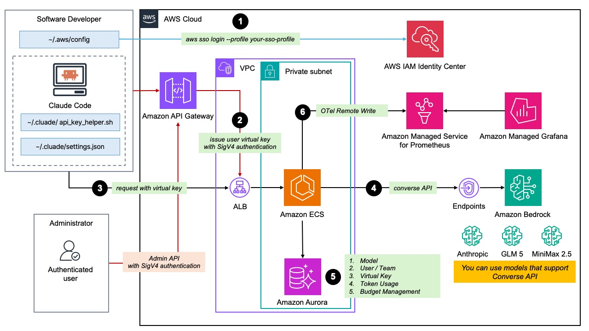
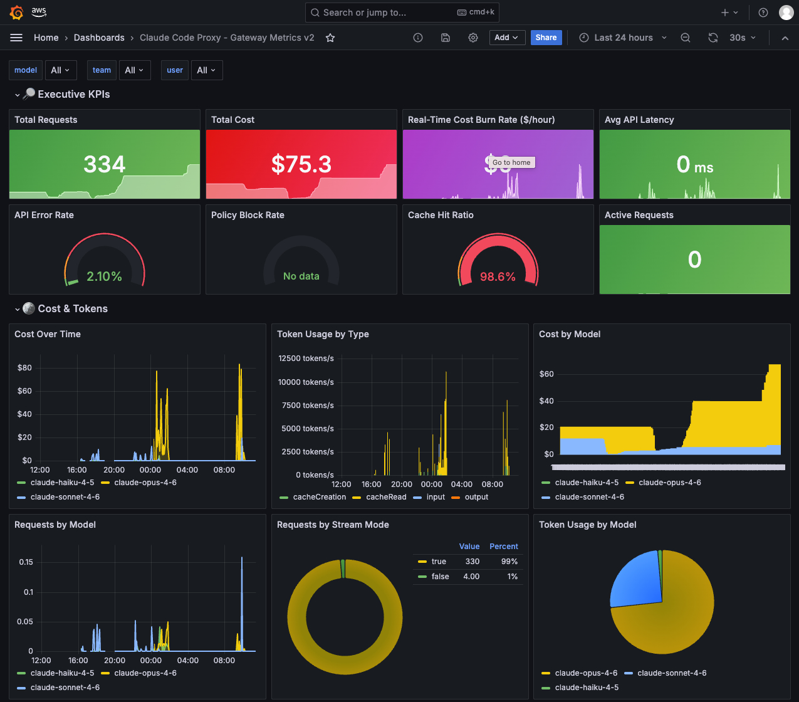

# Claude Code Proxy on AWS

Claude Code 호환 프록시 서비스. IAM Identity Center(SSO)로 인증된 사용자에게 가상 API 키를 발급하고, 정책 엔진을 거쳐 Amazon Bedrock으로 요청을 라우팅합니다.

## 아키텍처



## 주요 기능

- SSO 인증 기반 가상 API 키 발급 및 자동 재사용
- 8단계 정책 체인 엔진 (사용자/팀/모델/예산 정책 평가)
- Anthropic Messages API ↔ Bedrock Converse API 실시간 변환
- 모델 별칭 매핑 및 폴백 라우팅
- 스트리밍/논스트리밍 추론 지원
- 팀·사용자·모델별 예산 관리 및 사용량 추적
- IAM Identity Center 사용자 동기화
- ECS init container 기반 자동 DB 마이그레이션
- AWS CDK 기반 원클릭 배포

## 주요 컴포넌트

| 컴포넌트 | 위치 | 역할 |
|----------|------|------|
| Gateway | `gateway/` | FastAPI 앱. Runtime(추론), Auth(키 발급), Admin(관리), Sync(동기화) API |
| Shared | `shared/` | ORM 모델, 공용 응답/입력 스키마, 예외, KMS/해싱 유틸리티 |
| Migrations | `migrations/` | Alembic DB 마이그레이션 (ECS init container로 실행) |
| Infrastructure | `infra/` | AWS CDK 앱 (`FoundationStack`, `ServiceStack`) 및 supporting constructs |

## 디렉토리 구조

```
claude-code-proxy-on-aws/
├── gateway/                        # FastAPI 애플리케이션
│   ├── main.py                     # 앱 진입점, 라우터 등록
│   ├── core/                       # 설정, DB, 미들웨어, 텔레메트리
│   ├── domains/
│   │   ├── auth/                   # SSO 인증, 가상 API 키 발급 (/v1/auth/token)
│   │   ├── runtime/                # 추론 요청 처리 (/v1/messages)
│   │   │   └── converter/          # Anthropic ↔ Bedrock API 변환 로직
│   │   ├── policy/                 # 8단계 정책 체인 엔진
│   │   │   └── handlers/           # 개별 정책 핸들러 (사용자/팀/모델/예산 등)
│   │   ├── admin/                  # 관리 API (/v1/admin/*)
│   │   ├── sync/                   # IAM Identity Center 사용자 동기화
│   │   └── usage/                  # 사용량 집계 및 메트릭
│   └── repositories/               # DB 접근 계층 (SQLAlchemy)
├── shared/                         # 공용 모듈 (gateway + migrations 공유)
│   ├── models/                     # ORM 모델 (User, Team, VirtualKey, ModelCatalog 등)
│   ├── schemas/                    # Pydantic 입출력 스키마
│   ├── utils/                      # KMS 암호화, 해싱, 상수
│   └── exceptions.py               # 공용 예외 클래스
├── migrations/                     # Alembic DB 마이그레이션
│   └── versions/                   # 버전별 마이그레이션 스크립트
├── infra/                          # AWS CDK 인프라 코드
│   ├── app.py                      # CDK 앱 진입점
│   ├── config.py                   # 환경별 설정 (InfraContext)
│   ├── stacks/                     # FoundationStack, ServiceStack
│   └── cdk_constructs/             # Network, Data, Compute, ALB, API, Observability
├── tests/
│   ├── unit/gateway/               # Gateway 단위 테스트
│   ├── unit/shared/                # Shared 단위 테스트
│   └── test_*_stack.py             # CDK 스냅샷 테스트
├── scripts/
│   ├── deploy.sh                   # CDK 배포 스크립트 (대화형)
│   ├── api_key_helper.sh           # Claude Code용 SigV4 키 발급 helper
│   ├── local-bootstrap.py          # 로컬 개발 시드 데이터 삽입
│   └── local-entrypoint.sh         # Docker 로컬 시작 스크립트
├── assets/
│   ├── grafana_dashboard.json      # Grafana 대시보드 정의
│   └── observability/              # 로컬 O11y compose override용 설정
├── Dockerfile                      # 게이트웨이 컨테이너 이미지
├── docker-compose.yml              # 기본 로컬 개발 환경 (PostgreSQL + gateway)
└── docker-compose.observability.yml # 선택형 로컬 O11y (OTel + Prometheus + Grafana)
```

## 로컬 테스트

### 사전 요구사항

- Docker & Docker Compose
- AWS CLI v2 (`aws --version`)
- Bedrock 모델 접근 권한이 있는 AWS 계정 및 SSO 프로필

### 1. AWS SSO 로그인

로컬 게이트웨이가 Bedrock을 호출하려면 유효한 AWS 자격증명이 필요합니다.

```bash
aws sso login --profile <your-profile>
```

### 2. AWS 프로필 설정 (선택)

SSO 프로필이 `default`가 아닌 경우, 프로젝트 루트에 `.env.local` 파일을 생성합니다.

```bash
echo "AWS_PROFILE=<your-profile>" > .env.local
```

> `.env.local`은 `.gitignore`에 포함되어 있으며, 없어도 게이트웨이는 정상 기동됩니다. 이 경우 boto3 기본 자격증명 체인(환경변수 → `~/.aws/credentials` → default 프로필)을 사용합니다.

### 3. Docker Compose 실행

```bash
docker compose up --build
```

두 개의 서비스가 순서대로 기동됩니다:

```
┌─────────────────────────────────────────────────────────┐
│  postgres:16                                            │
│  ├─ DB: claude_proxy, user/pass: dev/dev                │
│  └─ healthcheck 통과 후 gateway 기동 허용               │
├─────────────────────────────────────────────────────────┤
│  gateway (FastAPI)                                      │
│  ├─ ~/.aws → /aws-config:ro 마운트 후                    │
│  │  /tmp/app-home/.aws 로 복사 (SSO refresh writable)   │
│  ├─ PostgreSQL 연결 대기 (최대 60초)                     │
│  ├─ local-bootstrap.py 실행 (시드 데이터 삽입)           │
│  │   ├─ 사용자: local-user                              │
│  │   ├─ 모델: claude-opus-4-6 / sonnet-4-6 / haiku-4-5 │
│  │   ├─ 별칭 매핑: 모델별 패턴 + * → sonnet 폴백         │
│  │   ├─ 기본 프롬프트 캐싱: 5m                          │
│  │   └─ 초기 ACTIVE 가상 키 시드                         │
│  ├─ OTLP exporter 비활성화 (로컬 기본값)                 │
│  └─ uvicorn :8000 시작                                  │
└─────────────────────────────────────────────────────────┘
```

게이트웨이가 정상 기동되면 다음 로그가 출력됩니다:

```
gateway-1 | INFO:     Uvicorn running on http://0.0.0.0:8000
```

### 선택: Observability 포함 실행

Prometheus/Grafana까지 함께 검증하려면 override compose를 추가로 사용합니다.

```bash
docker compose \
  -f docker-compose.yml \
  -f docker-compose.observability.yml \
  up --build
```

추가로 다음 서비스가 함께 기동됩니다:

- `otel-collector`: gateway의 OTLP gRPC 메트릭 수신 후 Prometheus 형식으로 노출
- `prometheus`: collector의 `/metrics` scrape
- `grafana`: Prometheus datasource와 기본 대시보드 자동 로드

접속 주소:

- Gateway: `http://localhost:8000`
- OTEL Collector metrics: `http://localhost:9464/metrics`
- Prometheus: `http://localhost:9090`
- Grafana: `http://localhost:3000` (`admin` / `admin`)



Grafana는 시작 시 기본 datasource와 로컬 provisioning용 대시보드 [`assets/observability/grafana/dashboard.local.json`](/Users/jungseob/workspace/claude-code-proxy-on-aws/assets/observability/grafana/dashboard.local.json)을 자동으로 불러옵니다. 원본 import용 대시보드는 [`assets/grafana_dashboard.json`](/Users/jungseob/workspace/claude-code-proxy-on-aws/assets/grafana_dashboard.json)에 유지됩니다.

주의사항:

- Gateway 비즈니스 메트릭은 주로 runtime 요청 처리 경로에서 발생합니다. `GET /v1/healthz`만 호출해서는 대시보드가 비어 있을 수 있습니다.
- 기본 OTLP export 주기는 60초이지만, `docker-compose.observability.yml`에서는 로컬 확인 편의를 위해 30초(`OTLP_EXPORT_INTERVAL_MILLIS=30000`)로 낮춰 둡니다.
- 로컬 O11y 모드에서는 `POST /v1/messages` 호출 후 Prometheus/Grafana에 반영되기까지 최대 30초 정도 지연될 수 있습니다.

### 4. Claude Code 연결

`settings.local.json`을 참고하여 Claude Code 설정을 구성합니다.

```json
{
  "apiKeyHelper": "/absolute/path/to/scripts/api_key_helper.local.sh",
  "env": {
    "ANTHROPIC_BASE_URL": "http://127.0.0.1:8000",
    "CLAUDE_CODE_API_KEY_HELPER_TTL_MS": "60000",
    "LOCAL_GATEWAY_AUTH_PRINCIPAL_ARN": "arn:aws:sts::local:assumed-role/GatewayAuth/local-user"
  }
}
```

- `apiKeyHelper`는 로컬 게이트웨이의 `/v1/auth/token`을 호출해 현재 Virtual Key를 stdout으로 출력합니다.
- `CLAUDE_CODE_API_KEY_HELPER_TTL_MS=60000`은 Claude Code가 1분마다 helper를 다시 실행하게 합니다.
- 로컬 게이트웨이는 기본적으로 `VIRTUAL_KEY_TTL_MS=300000`(5분)으로 실행되어, helper 재호출과 만료 후 자동 refresh를 로컬에서도 재현할 수 있습니다.
- `ANTHROPIC_BASE_URL`은 로컬 게이트웨이 주소를 가리킵니다.

> `apiKeyHelper` 경로는 절대 경로로 지정해야 합니다. `scripts/api_key_helper.local.sh`에 실행 권한(`chmod +x`)이 필요합니다.

### 5. 동작 확인

```bash
curl -s http://localhost:8000/v1/healthz
# {"status":"ok"}

LOCAL_KEY="$(./scripts/api_key_helper.local.sh)"
curl -s http://localhost:8000/v1/models \
  -H "x-api-key: ${LOCAL_KEY}" | python3 -m json.tool
```

### 로컬 환경 특이사항

| 항목 | 프로덕션 | 로컬 |
|------|---------|------|
| 인증 | SigV4 → IAM → SSO 사용자 조회 | local helper → `/v1/auth/token` (`local-user` principal) |
| KMS | AWS KMS 암호화/복호화 | `ENVIRONMENT=local` + `KMS_KEY_ID=local-dev-placeholder`일 때만 로컬 reversible fallback |
| DB 마이그레이션 | Alembic (ECS init container) | Alembic `upgrade head` 후 bootstrap에서 `Base.metadata.create_all`로 보완 |
| 모델 라우팅 | 모델별 별칭 매핑 | `claude-opus-4-6*`, `claude-sonnet-4-6*`, `claude-haiku-4-5*`, `*` → Sonnet 4.6 폴백 |
| Observability | ADOT sidecar → Amazon Managed Prometheus | 기본 비활성화, override compose로 로컬 OTel/Prometheus/Grafana 선택 기동 |
| AWS 자격증명 | ECS Task IAM Role | 호스트 `~/.aws`를 읽기 전용으로 마운트한 뒤 컨테이너 writable home으로 복사 |

## AWS 배포 및 테스트

### 사전 요구사항

- AWS CLI v2, CDK CLI, Docker, [uv](https://docs.astral.sh/uv/), jq
- Bedrock 모델 접근 권한이 있는 AWS 계정
- IAM Identity Center(SSO) 활성화

### 0. 환경변수 설정

이후 모든 단계에서 공통으로 사용할 환경변수를 먼저 설정합니다.

```bash
export AWS_PROFILE=<your-profile>        # SSO 프로필 이름
export AWS_REGION=<region>               # 예: ap-northeast-2
export API_GW_ID=<your-api-id>           # cdk-outputs.json의 API Gateway ID
export RUNTIME_BASE_URL=<http-or-https>://<your-runtime-host>  # ALB DNS 또는 커스텀 도메인

# SigV4 서명용 임시 자격증명 (Admin API 호출 시마다 만료 전 재실행)
eval "$(aws configure export-credentials --format env)"

# Admin API URL 및 공통 SigV4 옵션
API_URL="https://${API_GW_ID}.execute-api.${AWS_REGION}.amazonaws.com/prod"
SIGV4_OPTS=(
  --aws-sigv4 "aws:amz:${AWS_REGION}:execute-api"
  --user "${AWS_ACCESS_KEY_ID}:${AWS_SECRET_ACCESS_KEY}"
  -H "x-amz-security-token: ${AWS_SESSION_TOKEN:-}"
  -H "Content-Type: application/json"
)
```

### 1. 배포

```bash
aws sso login --profile ${AWS_PROFILE}
./scripts/deploy.sh
```

배포 스크립트가 리전 선택, Identity Store 설정, ACM 인증서, CDK 부트스트랩을 대화형으로 안내합니다. 배포 완료 후 API Gateway ID와 ALB DNS가 `cdk-outputs.json`에 출력됩니다. 해당 값으로 0단계 환경변수를 채워주세요.

### 2. Identity Center 사용자 동기화

IAM Identity Center의 사용자를 게이트웨이 DB에 동기화합니다.

```bash
curl -s -X POST "$API_URL/v1/admin/sync/identity-center" \
  "${SIGV4_OPTS[@]}" | python3 -m json.tool
```

동기화가 완료되어야 Identity Center 사용자가 `/v1/auth/token`에서 가상 API 키를 발급받을 수 있습니다. 이 단계를 건너뛰면 helper 호출은 `user_not_synced`로 실패합니다. 새 사용자가 추가되거나 퇴사자가 발생하면 동기화를 다시 실행하세요.

### 3. 모델 등록

Bedrock에서 사용할 모델 3개를 카탈로그에 등록합니다. 각 응답의 `"id"` 값을 다음 단계에서 사용합니다.

```bash
# Claude Sonnet 4.6
curl -s -X POST "$API_URL/v1/admin/models" "${SIGV4_OPTS[@]}" \
  -d '{
    "canonical_name": "claude-sonnet-4-6",
    "bedrock_model_id": "global.anthropic.claude-sonnet-4-6",
    "bedrock_region": "ap-northeast-2",
    "provider": "anthropic",
    "family": "claude-sonnet-4-6",
    "supports_prompt_cache": true
  }' | python3 -m json.tool

# Claude Opus 4.6
curl -s -X POST "$API_URL/v1/admin/models" "${SIGV4_OPTS[@]}" \
  -d '{
    "canonical_name": "claude-opus-4-6",
    "bedrock_model_id": "global.anthropic.claude-opus-4-6-v1",
    "bedrock_region": "ap-northeast-2",
    "provider": "anthropic",
    "family": "claude-opus-4-6",
    "supports_prompt_cache": true
  }' | python3 -m json.tool

# Claude Haiku 4.5
curl -s -X POST "$API_URL/v1/admin/models" "${SIGV4_OPTS[@]}" \
  -d '{
    "canonical_name": "claude-haiku-4-5",
    "bedrock_model_id": "global.anthropic.claude-haiku-4-5-20251001-v1:0",
    "bedrock_region": "ap-northeast-2",
    "provider": "anthropic",
    "family": "claude-haiku-4-5"
  }' | python3 -m json.tool
```

`bedrock_region`을 지정하면 모델별로 서로 다른 Bedrock Runtime 리전을 사용할 수 있습니다. 값을 생략하면 게이트웨이의 기본 `AWS_REGION`을 사용합니다.

### 4. 모델 가격 등록

모델별 가격 정보를 등록합니다. 가격이 없으면 추론 요청 시 `Active pricing is required` 오류가 발생합니다.

```bash
SONNET_ID="<3단계 Sonnet 응답의 id>"
OPUS_ID="<3단계 Opus 응답의 id>"
HAIKU_ID="<3단계 Haiku 응답의 id>"

# Claude Sonnet 4.6 가격
curl -s -X POST "$API_URL/v1/admin/model-pricing" "${SIGV4_OPTS[@]}" \
  -d "{
    \"model_id\": \"$SONNET_ID\",
    \"input_price_per_1k\": 0.003,
    \"output_price_per_1k\": 0.015,
    \"cache_read_price_per_1k\": 0.0003,
    \"cache_write_5m_price_per_1k\": 0.00375,
    \"cache_write_1h_price_per_1k\": 0.015,
    \"effective_from\": \"2025-01-01T00:00:00Z\"
  }" | python3 -m json.tool

# Claude Opus 4.6 가격
curl -s -X POST "$API_URL/v1/admin/model-pricing" "${SIGV4_OPTS[@]}" \
  -d "{
    \"model_id\": \"$OPUS_ID\",
    \"input_price_per_1k\": 0.015,
    \"output_price_per_1k\": 0.075,
    \"cache_read_price_per_1k\": 0.0015,
    \"cache_write_5m_price_per_1k\": 0.01875,
    \"cache_write_1h_price_per_1k\": 0.075,
    \"effective_from\": \"2025-01-01T00:00:00Z\"
  }" | python3 -m json.tool

# Claude Haiku 4.5 가격
curl -s -X POST "$API_URL/v1/admin/model-pricing" "${SIGV4_OPTS[@]}" \
  -d "{
    \"model_id\": \"$HAIKU_ID\",
    \"input_price_per_1k\": 0.0008,
    \"output_price_per_1k\": 0.004,
    \"cache_read_price_per_1k\": 0.00008,
    \"cache_write_5m_price_per_1k\": 0.001,
    \"cache_write_1h_price_per_1k\": 0.004,
    \"effective_from\": \"2025-01-01T00:00:00Z\"
  }" | python3 -m json.tool
```

### 5. 별칭 매핑 등록

Claude Code가 요청하는 모델 이름 패턴을 등록된 모델로 연결합니다.

```bash
# claude-sonnet-4-6* → Sonnet 4.6
curl -s -X POST "$API_URL/v1/admin/model-mappings" "${SIGV4_OPTS[@]}" \
  -d "{\"selected_model_pattern\": \"claude-sonnet-4-6*\", \"target_model_id\": \"$SONNET_ID\", \"priority\": 30, \"is_fallback\": false}" | python3 -m json.tool

# claude-opus-4-6* → Opus 4.6
curl -s -X POST "$API_URL/v1/admin/model-mappings" "${SIGV4_OPTS[@]}" \
  -d "{\"selected_model_pattern\": \"claude-opus-4-6*\", \"target_model_id\": \"$OPUS_ID\", \"priority\": 20, \"is_fallback\": false}" | python3 -m json.tool

# claude-haiku-4-5* → Haiku 4.5
curl -s -X POST "$API_URL/v1/admin/model-mappings" "${SIGV4_OPTS[@]}" \
  -d "{\"selected_model_pattern\": \"claude-haiku-4-5*\", \"target_model_id\": \"$HAIKU_ID\", \"priority\": 10, \"is_fallback\": false}" | python3 -m json.tool

# 폴백 매핑 (* → Sonnet 4.6, 매칭되지 않는 모든 요청에 적용)
curl -s -X POST "$API_URL/v1/admin/model-mappings" "${SIGV4_OPTS[@]}" \
  -d "{\"selected_model_pattern\": \"*\", \"target_model_id\": \"$SONNET_ID\", \"priority\": 0, \"is_fallback\": true}" | python3 -m json.tool
```

> `priority`가 높을수록 먼저 평가됩니다. 폴백 매핑은 `is_fallback: true`로 설정하고 가장 낮은 priority를 부여합니다.

### 6. API Key Helper 설정

`scripts/settings.json`을 참고하여 Claude Code 설정을 구성합니다.

```json
{
  "apiKeyHelper": "/absolute/path/to/scripts/api_key_helper.sh",
  "env": {
    "ANTHROPIC_BASE_URL": "<RUNTIME_BASE_URL>"
  }
}
```

- `ANTHROPIC_BASE_URL`은 API Gateway가 아니라 런타임을 받는 퍼블릭 ALB 또는 그 앞의 커스텀 도메인을 가리켜야 합니다.
- ACM 인증서/커스텀 도메인이 없으면 `http://<AlbDnsName>`를 사용합니다.
- `scripts/api_key_helper.sh`는 `POST /v1/auth/token`용 API Gateway 엔드포인트를 사용합니다.
- 이 스크립트는 저장소 밖 `~/.claude` 같은 위치로 복사해 쓰는 것을 가정합니다.
- 필요한 환경변수:
  - `AWS_PROFILE`: SSO 프로필 이름 (기본값: `ccob`)
  - `API_GW_ID`: 0단계에서 설정한 API Gateway ID
  - `AWS_REGION`: 0단계에서 설정한 AWS 리전

첫 실행 시 helper가 SigV4 인증으로 가상 API 키를 자동 발급합니다.

#### Virtual Key TTL

- `VIRTUAL_KEY_TTL_MS`로 Virtual Key TTL을 밀리초 단위로 설정할 수 있습니다. 기본값은 `14400000`(4시간)이고, `0`이면 만료를 비활성화합니다.
- 런타임 요청에서 키가 만료되면 게이트웨이는 `401 virtual_key_expired`를 반환합니다.
- Claude Code는 401 이후 `apiKeyHelper`를 다시 실행해 새 키를 받아올 수 있습니다.
- TTL 기반 자동 재발급은 **기존 `ACTIVE` key row를 업데이트**합니다.
- 관리자 rotate는 **기존 row를 `ROTATED`로 남기고 새 `ACTIVE` row를 생성**합니다.

원하면 Claude Code 설정에 `CLAUDE_CODE_API_KEY_HELPER_TTL_MS`를 TTL보다 짧게 넣어 선행 재호출을 유도할 수 있지만, 이 값이 없어도 401 기반 재실행으로 동작합니다.

### 7. 동작 확인

```bash
# 헬스체크
curl -s "$RUNTIME_BASE_URL/v1/healthz"
# {"status":"ok"}

# 모델 목록 (등록된 매핑 확인)
curl -s "$RUNTIME_BASE_URL/v1/models" \
  -H "x-api-key: <your-api-key>" | python3 -m json.tool
```

### 8. Claude Code 실행

설정이 완료되면 Claude Code를 실행하여 게이트웨이가 정상 동작하는지 확인합니다.

### 9. 스택 삭제

```bash
./scripts/deploy.sh destroy
```

## 문서

| 문서 | 내용 |
|------|------|
| [docs/README.md](./docs/README.md) | 문서 인덱스 |
| [docs/SYSTEM_ARCHITECTURE.md](./docs/SYSTEM_ARCHITECTURE.md) | 시스템 아키텍처 |
| [docs/API_SPEC.md](./docs/API_SPEC.md) | API 상세 스펙 |
| [docs/DATA_MODEL.md](./docs/DATA_MODEL.md) | 데이터 모델 |
| [docs/RUNTIME_TRANSLATION.md](./docs/RUNTIME_TRANSLATION.md) | Anthropic ↔ Bedrock 변환 규칙 |

## 라이선스

This library is licensed under the Apache 2.0 License.
