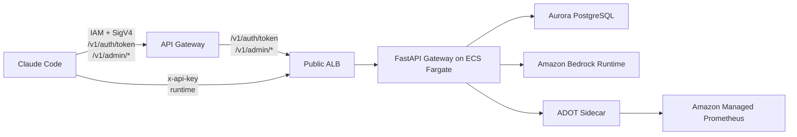

# System Architecture

This document describes the architecture implemented in the repository today.

## Runtime Topology

## Component Status

| Component | Status | Notes |
| --- | --- | --- |
| Gateway auth endpoint | Implemented | Issues or reuses one active virtual key per user on `/v1/auth/token` |
| Gateway FastAPI | Implemented | Runtime, admin, and sync routers are wired in `gateway/main.py`; FastAPI lifespan disposes shared SQLAlchemy engines on shutdown |
| PostgreSQL schema | Implemented | Single initial migration defines current schema |
| Admin API ingress | Implemented | API Gateway proxies admin paths through the public ALB and injects admin headers |
| Identity sync | Implemented | Manual trigger lists Identity Center users, upserts `users`, and inactivates missing rows |
| Usage aggregates | Partial | Aggregate tables and read APIs exist, but runtime does not populate them |
| Metrics pipeline | Partial | Gateway emits OTLP metrics when configured; local compose disables export by default and does not run a collector |
| CDK stacks | Partial | Stacks are present, but local CDK tests currently fail on Aurora engine constant mismatch |

## Request Flows

### Token issuance

1. Claude Code calls API Gateway with IAM-authenticated `POST /v1/auth/token`.
2. API Gateway proxies the request through the ALB to the FastAPI gateway on ECS and injects `x-auth-origin` and `x-auth-principal`.
3. Gateway extracts the session name from the IAM principal ARN and resolves an active `users` row by `user_name`, `identity_store_user_id`, then email fallback.
4. Gateway reuses an existing active virtual key or creates a new one.
5. The response returns the key secret.

### Runtime inference

1. Claude Code calls the public ALB with `x-api-key`.
2. Gateway hashes the API key and resolves the matching `virtual_keys` row.
3. Policy handlers validate user status, default team status, model mapping, model policy, budgets, and cache policy. Runtime lookups are served through the Aurora reader session where available.
4. Gateway converts the request to Bedrock `converse` or `converse_stream` and reuses an app-scoped Bedrock runtime client.
5. On success, gateway records a `usage_events` row and updates budget counters through the Aurora writer session.

### Admin access

1. Operator calls API Gateway with IAM auth.
2. API Gateway forwards `/v1/admin/*` to the ALB.
3. The gateway middleware accepts the request only when `x-admin-origin` matches the configured trusted value.
4. Dependency wiring requires `x-admin-principal`; without it the gateway returns `admin_principal_missing`.

### Manual sync

1. Operator calls `POST /v1/admin/sync/identity-center`.
2. Gateway creates an `identity_sync_runs` row.
3. Gateway lists users from the configured AWS IAM Identity Center identity store.
4. Existing users are upserted by `identity_store_user_id`, `last_synced_at` is refreshed, and `source_deleted_at` is cleared for seen users.
5. Users no longer returned by Identity Center are marked `INACTIVE` and `source_deleted_at` is set.
6. The sync run row is updated with created/updated/inactivated counters and terminal status.

## Auth Boundaries

### Auth endpoint

- External contract: IAM + SigV4 through API Gateway
- App-level identity source: `x-auth-principal` injected by API Gateway for `/v1/auth/token`

### Runtime gateway

- External contract: `x-api-key`
- Validation method: SHA-256 fingerprint lookup in `virtual_keys`

### Admin APIs

- External contract: IAM + SigV4 through API Gateway
- App-level enforcement:
  - `x-admin-origin` must equal `apigw` by default
  - `x-admin-principal` must be present

## Data Flow

- Durable source of truth for requests and cost: `usage_events`
- Durable source of truth for governance: users, teams, model catalog, policies, budgets
- Aggregate tables exist but are not maintained by runtime
- Prompts and completions are not persisted by current gateway code

## Infrastructure Shape

Implemented stacks:

- [`infra/stacks/foundation_stack.py`](/Users/jungseob/workspace/claude-code-proxy-on-aws/infra/stacks/foundation_stack.py)
- [`infra/stacks/service_stack.py`](/Users/jungseob/workspace/claude-code-proxy-on-aws/infra/stacks/service_stack.py)
- [`infra/stacks/gateway_task_definition.py`](/Users/jungseob/workspace/claude-code-proxy-on-aws/infra/stacks/gateway_task_definition.py)
- Supporting constructs under `infra/cdk_constructs/`

Key points:

- The ECS gateway image is built from the repository `Dockerfile`.
- The ECS task definition includes a `migrate` init container, a `gateway-app` container, and a non-essential `adot-collector` sidecar. The `gateway-app` container depends on the `migrate` container completing successfully before starting.
- API Gateway provisions only `/v1/auth/token` and `/v1/admin/{proxy+}` integrations, both proxying through the ALB into the ECS gateway service.
- Runtime endpoints (`/v1/healthz`, `/v1/models`, `/v1/messages`) are served directly from the public ALB into the ECS gateway service.
- Gateway tasks connect directly to the Aurora cluster writer and reader endpoints.
- Runtime policy and catalog lookups use the reader session wiring where available; token issuance, admin mutations, usage persistence, and budget updates use the writer session.
- Interface endpoints are provisioned for Bedrock Runtime, ECR, Logs, Secrets Manager, KMS, STS, ECS, Identity Store, and AMP, plus an S3 gateway endpoint for dependency access.
- CDK context defaults `identity_store_id` to `placeholder`; manual sync rejects empty or placeholder values at runtime.

## Known Gaps

- `GET /v1/models` authenticates the caller but returns all active models, not a policy-filtered subset.
- Usage aggregates are queryable only if populated externally.
- Local compose does not provision an ADOT collector and disables OTLP export by default.
- Local CDK snapshot tests currently fail because `AuroraPostgresEngineVersion.VER_15_15` is unavailable in the installed CDK package.
